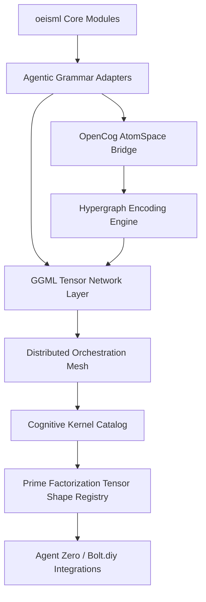
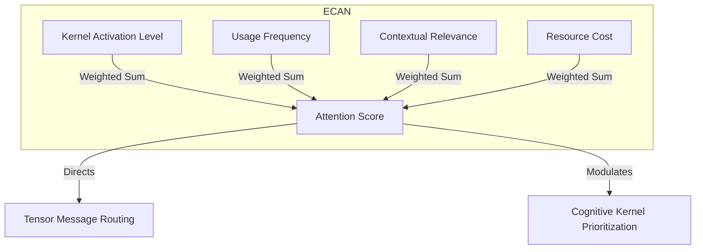
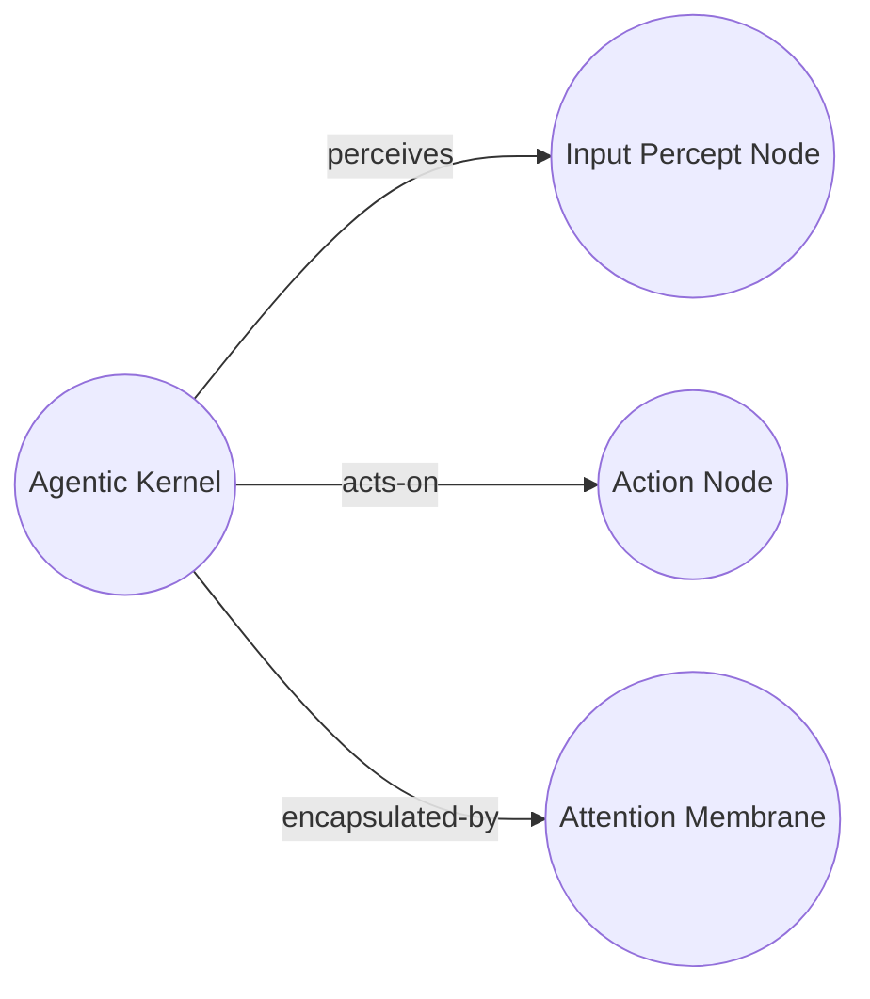

# GGML Agentic Cognitive Grammar Integration Architecture

This document describes the architecture for integrating Z-GNN/oeisml as a distributed GGML tensor network of agentic cognitive grammar, implementing the transdisciplinary cognitive flowchart specified in the requirements.

## Architecture Overview



## Implementation Layers

### 1. OEIS Sequence Analysis Layer
- **Module**: `scripts/analyze-oeis-sequences.js`
- **Purpose**: Parse OEIS sequences and extract cognitive patterns
- **Key Functions**:
  - Sequence complexity analysis
  - Semantic dimension extraction
  - Tensor shape determination
  - Prime factorization for cognitive decomposition

### 2. GGML Tensorization Layer
- **Module**: `scripts/tensorize-sequences.js`
- **Purpose**: Convert OEIS sequences to GGML-compatible tensors
- **Key Functions**:
  - Data normalization and quantization
  - Tensor shape alignment for GGML
  - Batch processing for scalability
  - Binary tensor format generation

### 3. Agentic Grammar Adaptation Layer
- **Module**: `scripts/generate-grammar-adapters.js`
- **Purpose**: Map sequence properties to agentic primitives
- **Key Functions**:
  - Capability extraction and mapping
  - Behavioral pattern recognition
  - Cognitive role assignment
  - Grammar rule generation

### 4. Distributed Orchestration Layer
- **Module**: `scripts/orchestrate-cognitive-mesh.js`
- **Purpose**: Create and manage distributed cognitive mesh
- **Key Functions**:
  - Topology creation and optimization
  - Load balancing across cognitive kernels
  - Clustering for redundancy
  - Performance metrics generation

### 5. ECAN Attention Allocation Layer
- **Module**: `scripts/deploy-ecan-attention.js`
- **Purpose**: Implement adaptive attention mechanisms
- **Key Functions**:
  - Short/Long/Very-Long-Term Importance calculation
  - Spreading activation through network
  - Attentional focus selection
  - Resource allocation based on attention

## Integration Points

### Agent Zero Integration
- **Module**: `scripts/integrate-agent-zero.js`
- **Purpose**: Bridge to Agent Zero runtime
- **Features**:
  - Agent definition generation
  - Behavioral script creation
  - Runtime connector setup
  - Communication protocol mapping

### Bolt.diy Integration
- **Module**: `scripts/setup-bolt-bridges.js`
- **Purpose**: Development environment integration
- **Features**:
  - Development API server
  - Live reload system
  - IDE extensions
  - CLI tools

### OpenCog AtomSpace Integration
- **Module**: `scripts/sync-atomspace.js`
- **Purpose**: Bidirectional sync with OpenCog
- **Features**:
  - Atom and link creation
  - Truth value calculation
  - Hypergraph representation
  - Scheme code generation

## Tensor Shape Registry

The system uses prime factorization to determine optimal tensor shapes for each cognitive kernel:

```scheme
;; Example tensor shape assignment
(define (assign-tensor-shape agentic-function)
  (let* ((semantic-dims (list 'context 'time 'salience))
         (shape (map get-dimension-size semantic-dims)))
    (prime-factorize shape)))
```

## Attention Allocation Mechanism

The ECAN-inspired attention system manages cognitive resources:



## Hypergraph Pattern Encoding

Cognitive kernels are represented as hypergraph patterns:



## Performance Metrics

The system tracks several key performance indicators:
- Tensor network efficiency
- Attention allocation balance
- Cognitive complexity distribution
- Load balancing effectiveness
- Integration connectivity health

## Deployment and Testing

### GitHub Actions Workflow
The system is deployed via the `.github/workflows/ggml-integration.yml` workflow, which:
1. Sets up cognitive infrastructure
2. Processes sequences in parallel batches
3. Orchestrates the distributed mesh
4. Integrates with external frameworks
5. Deploys cognitive services

### Testing Framework
Comprehensive tests in `tests/cognitive.test.js` validate:
- OEIS sequence analysis accuracy
- Tensor operation correctness
- Attention allocation functionality
- Mesh orchestration performance
- Integration component connectivity

## Future Extensions

1. **Dynamic Reconfiguration**: Real-time mesh topology adaptation
2. **Multi-modal Integration**: Support for non-numerical sequences
3. **Federated Learning**: Distributed training across cognitive kernels
4. **Quantum Computing Bridge**: Interface for quantum tensor operations
5. **Neuromorphic Hardware**: Integration with specialized AI chips

This architecture provides a robust foundation for cognitive AI research while maintaining the mathematical rigor of the OEIS dataset and the performance advantages of GGML tensor operations.