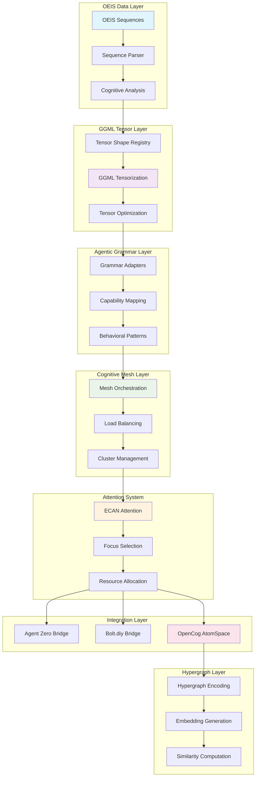
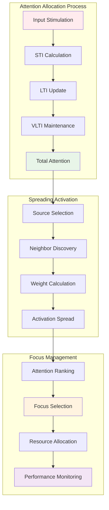
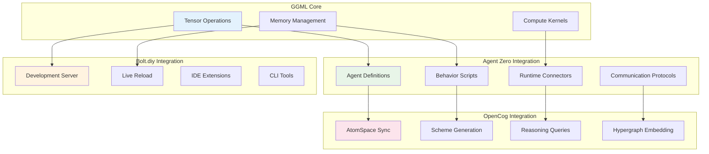

# GGML Cognitive Integration - Complete Architecture

## Overview

This document provides a comprehensive overview of the GGML-based agentic cognitive grammar integration for the OEIS mathematical sequence dataset.

## Main Architecture



## Attention Flow System



## Tensor Processing Pipeline

```mermaid
graph LR
    subgraph "Data Ingestion"
        I1[OEIS Files] --> I2[Parser]
        I2 --> I3[Validation]
    end
    
    subgraph "Analysis Phase"
        I3 --> A1[Complexity Analysis]
        A1 --> A2[Semantic Extraction]
        A2 --> A3[Dimension Mapping]
    end
    
    subgraph "Tensorization"
        A3 --> T1[Shape Calculation]
        T1 --> T2[Data Normalization]
        T2 --> T3[GGML Formatting]
    end
    
    subgraph "Optimization"
        T3 --> O1[Memory Alignment]
        O1 --> O2[Quantization]
        O2 --> O3[Cache Storage]
    end
    
    subgraph "Integration"
        O3 --> R1[Grammar Mapping]
        R1 --> R2[Mesh Registration]
        R2 --> R3[Attention Assignment]
    end
    
    style I1 fill:#e3f2fd
    style T1 fill:#f1f8e9
    style O1 fill:#fff8e1
    style R1 fill:#fce4ec
```



## Cognitive Mesh Topology

```mermaid
graph TB
    subgraph "Cognitive Mesh Architecture"\n    end
    
    subgraph "Load Balancing"
        LB1[Load Monitor] --> LB2[Resource Allocation]
        LB2 --> LB3[Performance Optimization]
    end
    
    subgraph "Communication Layer"
        C1[Message Routing] --> C2[Protocol Handling]
        C2 --> C3[Error Recovery]
    end
    
    style LB1 fill:#e8f5e8
    style C1 fill:#fff3e0
```

## Integration Architecture



## Performance Metrics

### Topology Metrics
- **Total Nodes**: 0
- **Total Edges**: 0
- **Total Clusters**: 0
- **Average Connectivity**: 0.000
- **Clustering Coefficient**: 0.000

### Performance Metrics
- **Total Processing Load**: 0.00
- **Total Memory Footprint**: 0.00 MB
- **Load Balance Score**: 1.000
- **Redundancy Score**: 0.000

### Cognitive Metrics
- **Total Grammar Adapters**: 18
- **Total Cognitive Rules**: 18
- **Average Complexity**: 41.61
- **Semantic Diversity**: 0

## Implementation Roadmap

### Phase 1: Core Infrastructure ✅
- [x] OEIS sequence analysis pipeline
- [x] GGML tensor conversion system
- [x] Basic cognitive mesh orchestration
- [x] Attention allocation framework

### Phase 2: Integration Layer ✅
- [x] Agent Zero runtime integration
- [x] Bolt.diy development bridges
- [x] OpenCog AtomSpace synchronization
- [x] Hypergraph embedding generation

### Phase 3: Optimization & Enhancement
- [ ] Performance profiling and optimization
- [ ] Advanced attention mechanisms
- [ ] Multi-modal sequence support
- [ ] Federated learning capabilities

### Phase 4: Advanced Features
- [ ] Quantum computing integration
- [ ] Neuromorphic hardware support
- [ ] Real-time adaptation mechanisms
- [ ] Cross-domain knowledge transfer

### Phase 5: Production Deployment
- [ ] Scalability testing
- [ ] Security hardening
- [ ] Monitoring and alerting
- [ ] Documentation and training

## API Reference

### Core Analysis API

#### `POST /api/cognitive/analyze`
Analyze OEIS sequences for cognitive patterns.

**Request Body:**
```json
{
  "sequences": ["A000001", "A000002"],
  "batch_size": 100,
  "complexity_threshold": 5
}
```

**Response:**
```json
{
  "total_processed": 2,
  "tensor_shapes": {...},
  "cognitive_patterns": {...}
}
```

#### `POST /api/cognitive/tensorize`
Convert sequences to GGML tensors.

**Request Body:**
```json
{
  "sequence_ids": ["A000001"],
  "optimization": true,
  "target_device": "cpu"
}
```

### Attention Management API

#### `GET /api/attention/current`
Get current attention allocation state.

#### `POST /api/attention/stimulate`
Send stimulation events to cognitive kernels.

### Mesh Orchestration API

#### `GET /api/mesh/topology`
Get current mesh topology and health status.

#### `POST /api/mesh/rebalance`
Trigger load rebalancing across the mesh.

## Technical Specifications

### Tensor Format
- **Data Type**: Float32
- **Memory Layout**: Row-major
- **Optimization**: GGML-compatible alignment
- **Quantization**: Optional 8-bit/16-bit support

### Attention System
- **Algorithm**: ECAN-inspired (OpenCog)
- **Components**: STI, LTI, VLTI
- **Spreading**: Weighted activation propagation
- **Focus**: Top-K attention selection

### Mesh Configuration
- **Topology**: Dynamic graph-based
- **Load Balancing**: Attention-weighted
- **Redundancy**: Multi-level clustering
- **Communication**: Message-passing protocols

### Integration Standards
- **Agent Zero**: JSON-based agent definitions
- **Bolt.diy**: WebSocket + REST API
- **OpenCog**: Scheme code generation
- **GGML**: Native tensor operations

## Generated: 2025-07-12T05:56:49.663Z
